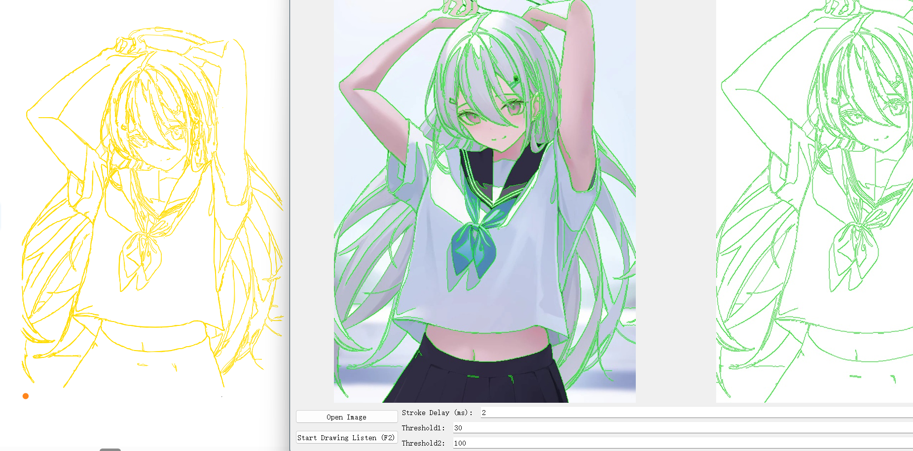

## Drawer

version = 0.0.3-beta

python >= 3.8.8 64-bit

**加载图片并生成其轮廓图，控制鼠标在屏幕中绘制轮廓图，用于鼠绘涂鸦**

如果你想在鼠标被控制的中途中断操作，请使用键盘上的ESC

 - 点击 "start drawing listen" 按钮后，会监听键盘F2按键，按下F2开始绘制
 - 如果改变配置需要再次点击 "start drawing listen"

